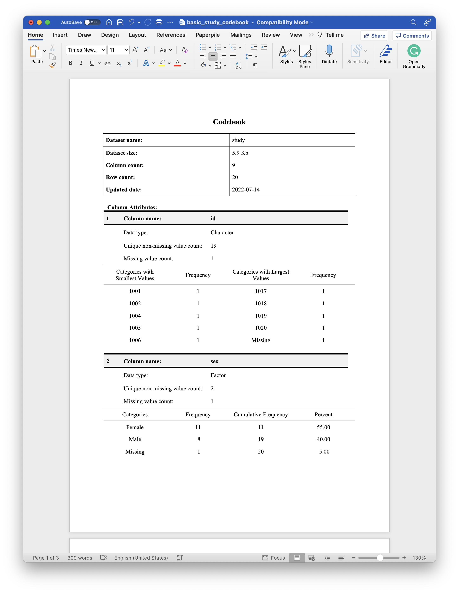
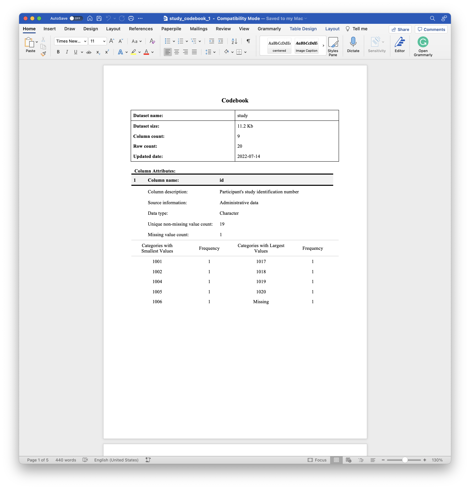
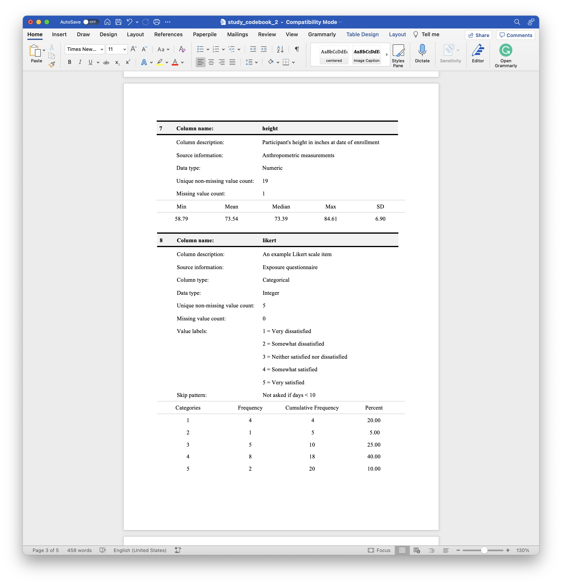
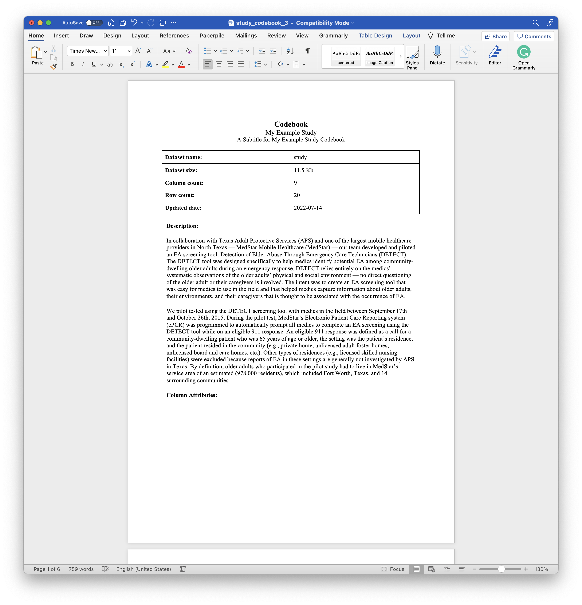
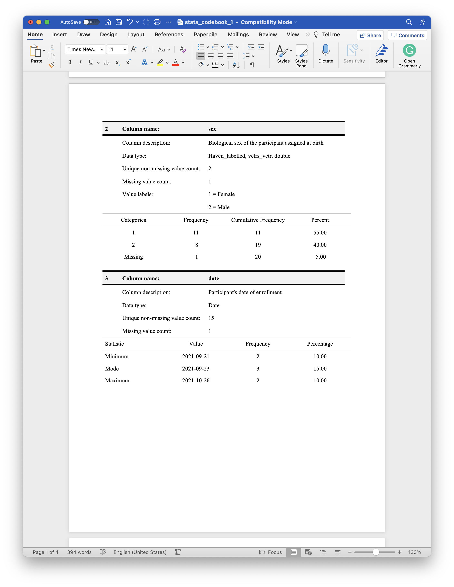
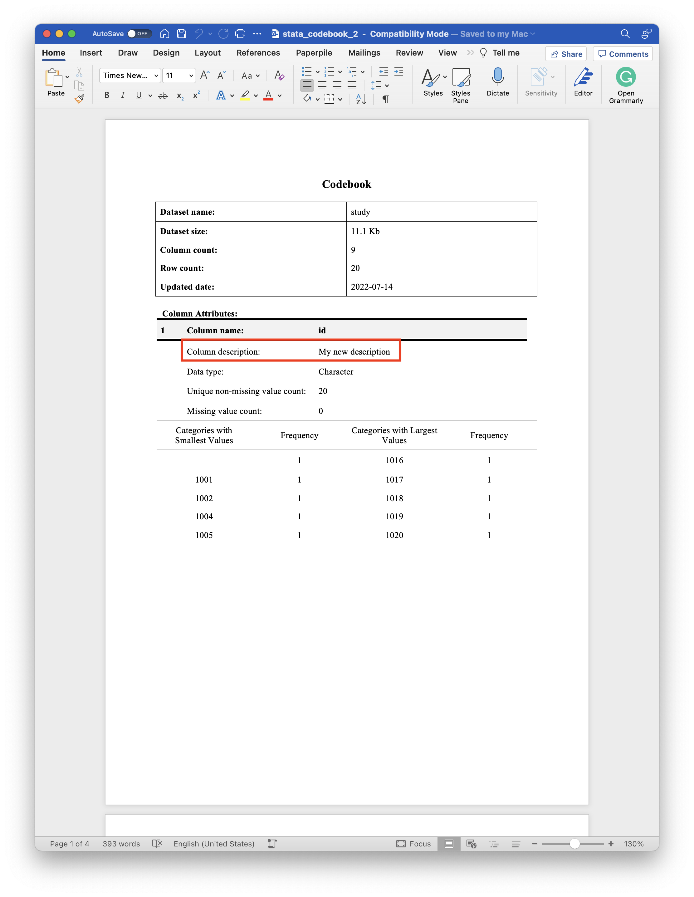
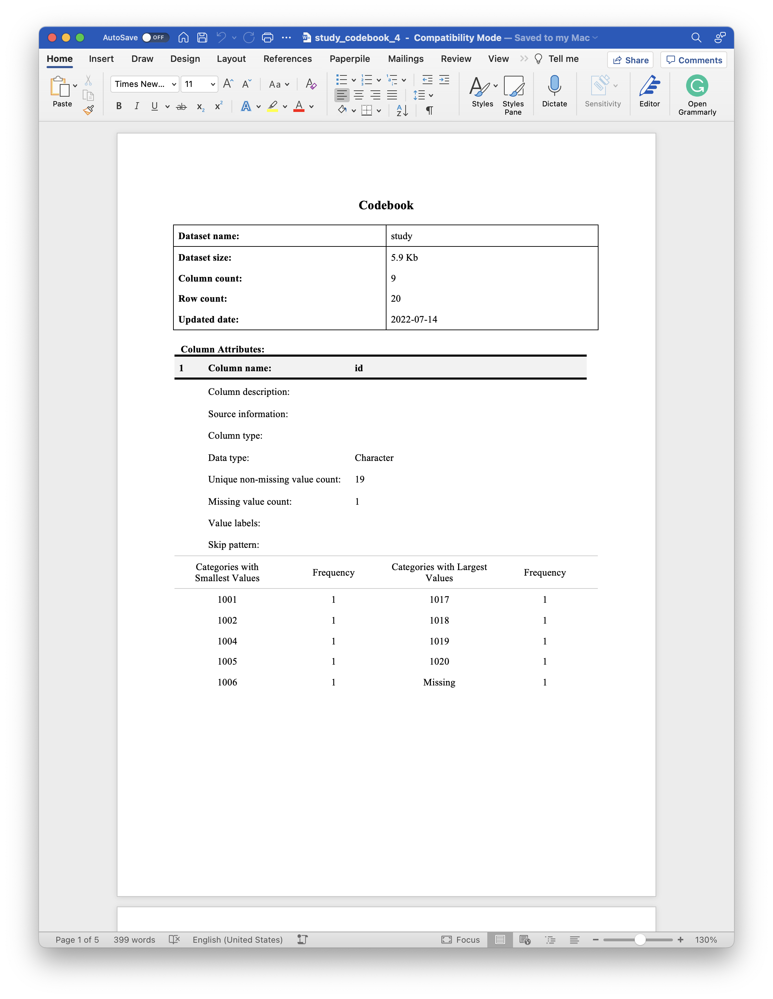

<!-- README.md is generated from README.Rmd. Please edit that file -->

# codebookr

<!-- badges: start -->
<!-- badges: end -->

The `codebookr` package is intended to make it easy for users to create
codebooks (also called data dictionaries) directly from an R data frame.

Under the hood, `codebookr` uses the
[flextable](https://ardata-fr.github.io/flextable-book/) and
[officer](https://davidgohel.github.io/officer/index.html) packages
extensively to create the codebook as a Word document.

## Installation

You can install the development version of codebookr like so:

``` r
# install.packages("devtools")
devtools::install_github("brad-cannell/codebookr")
```

## codebookr functions

-   **codebook:** The `codebook()` function assists with the creation of
    a codebook for a given R data frame.

-   **cb_add_col_attributes:** This is a helper function that makes it
    easier to add arbitrary attributes to R data frame columns (e.g.,
    description, source, column type). These attributes can later be
    accessed by the `codebook()` function to fill in the column
    attributes table for each column in the codebook.

## Example 1: The most basic use case

We will start by demonstrating a complete, bare minimum example without
any modification to our example data or any of the default values in the
`codebook()` function. After walking through this example, we will
demonstrate several ways to improve the codebook document by adding
attributes to our data frame. We will also demonstrate the effects of
adjusting some of `codebook()`s default values. Finally, we will
demonstrate some techniques to make the codebook creation process more
efficient in a couple of common use cases.

Let’s start by loading `codebookr` and `dplyr`.

``` r
library(codebookr)
library(dplyr, warn.conflicts = FALSE)
library(haven)
```

### Load data

For the purposes of making a self-contained example, the `codebookr`
package comes with a small example data frame that is intended to have
some of the features of real study data. We will use it to demonstrate
how to use `codebookr` below.

``` r
# Load example data
data(study)
```

``` r
glimpse(study)
#> Rows: 20
#> Columns: 9
#> $ id        <chr> "1001", "1002", NA, "1004", "1005", "1006", "1007", "1008", …
#> $ sex       <fct> Female, Female, Female, NA, Female, Male, Male, Male, Female…
#> $ date      <date> 2021-10-12, 2021-09-23, 2021-10-13, 2021-10-19, NA, 2021-10…
#> $ time      <time> 08:56:40, 13:26:09, 09:24:22, 08:37:26, 09:20:59, 11:14:52,…
#> $ date_time <dttm> 2021-10-12 08:56:40, 2021-09-23 13:26:09, 2021-10-13 09:24:…
#> $ days      <int> 3, 15, 21, 5, 8, NA, 10, 18, 10, 12, 2, 10, 12, 20, 14, 17, …
#> $ height    <dbl> 81.25571, 68.15227, 58.79282, 72.81303, 69.61109, 71.05764, …
#> $ likert    <int> 5, 3, 4, 4, 1, 4, 1, 3, 4, 3, 5, 4, 4, 4, 1, 2, 3, 4, 3, 1
#> $ outcome   <lgl> TRUE, FALSE, FALSE, TRUE, TRUE, FALSE, TRUE, TRUE, FALSE, FA…
```

### Pass the data frame to the `codebook` function

In this first example, we will simply pass the `study` data frame to the
`codebook()` function without making any alterations. We will save the
resulting `rdocx` object (described in greater detail below) in our
global environment as the `study_codebook` object.

``` r
study_codebook <- codebook(study)
```

### Create the Word codebook document

Finally, we will pass the `study_codebook` object we just created to the
`print()` function along with the path to Word document we want to
create.

``` r
print(study_codebook, "basic_study_codebook.docx")
```

The code above produces the following document, which you can click to
view/download on Dropbox. You may also download it from the files pane
above.

[](https://www.dropbox.com/s/qcijxgyeh4ib4d3/basic_study_codebook.docx?dl=0)

As you may see in the example document above, the default codebook
document includes two major sections. They are:

1.  A **metadata table**. This table includes some metadata about the
    data frame. Currently, the data frame’s name, size, number of
    columns, and number of rows are included in the metadata table. The
    final row of the metadata table gives the date when the codebook
    (but not necessarily the data frame) was last updated.

2.  The **column attributes tables**. The codebook will include a tables
    of column attributes for each column in the data frame passed to the
    `codebook()` function. By default, the top half of the column
    attributes table includes the column’s name, data type, the number
    of unique non-missing values, and the total number of missing
    values. Below, we will discuss other optional attributes that may be
    added to this table. The bottom half of each column attributes table
    will include some basic descriptive statistics. Which statistics are
    displayed depends on the what type of data the column contains. This
    is discussed in greater detail below.

    -   The value for `Data type` is just the value returned by passing
        the column to base R’s `class()` function. Below, we will
        discuss adding the `Column type` attribute, which allows the
        user to add additional information about the values in each
        column.

## Example 2: A more informative codebook

The previous example gave us a complete codebook, but there’s a lot of
room for improvement. This example is still pretty simple, but it
demonstrates how to use the `codebookr` package to make a codebook from
a **labeled** data frame.

Once again, we will begin by loading the example `study` data.

``` r
# Load example data
data(study)
```

``` r
glimpse(study)
#> Rows: 20
#> Columns: 9
#> $ id        <chr> "1001", "1002", NA, "1004", "1005", "1006", "1007", "1008", …
#> $ sex       <fct> Female, Female, Female, NA, Female, Male, Male, Male, Female…
#> $ date      <date> 2021-10-12, 2021-09-23, 2021-10-13, 2021-10-19, NA, 2021-10…
#> $ time      <time> 08:56:40, 13:26:09, 09:24:22, 08:37:26, 09:20:59, 11:14:52,…
#> $ date_time <dttm> 2021-10-12 08:56:40, 2021-09-23 13:26:09, 2021-10-13 09:24:…
#> $ days      <int> 3, 15, 21, 5, 8, NA, 10, 18, 10, 12, 2, 10, 12, 20, 14, 17, …
#> $ height    <dbl> 81.25571, 68.15227, 58.79282, 72.81303, 69.61109, 71.05764, …
#> $ likert    <int> 5, 3, 4, 4, 1, 4, 1, 3, 4, 3, 5, 4, 4, 4, 1, 2, 3, 4, 3, 1
#> $ outcome   <lgl> TRUE, FALSE, FALSE, TRUE, TRUE, FALSE, TRUE, TRUE, FALSE, FA…
```

### Column types

Although R recognizes many different column types, most of which the
`study` data contains, `codebook()` classifies all columns as one of
four types and uses these categories to determine which descriptive
statistics to use in the codebook document:

1.  **Categorical with many different categories**, for example the `id`
    column of the `study` data frame.  
2.  **Categorical with few different categories**, for example the `sex`
    column of the `study` data frame.  
3.  **Time**, for example the `date` column of the `study` data frame.  
4.  **Numeric**, for example the `height` column of the `study` data
    frame.

Here are the default summary statistics returned by the `codebook()`
function for each of the column types list above:

#### Categorical variables with many different categories

| lowest_cats | lowest_freq | highest_cats | highest_freq |
|:------------|------------:|:-------------|-------------:|
| 1001        |           1 | 1017         |            1 |
| 1002        |           1 | 1018         |            1 |
| 1004        |           1 | 1019         |            1 |
| 1005        |           1 | 1020         |            1 |
| 1006        |           1 | Missing      |            1 |

#### Categorical variables with few different categories

| cat     | n   | cum_freq | percent |
|:--------|:----|:---------|:--------|
| Female  | 11  | 11       | 55.00   |
| Male    | 8   | 19       | 40.00   |
| Missing | 1   | 20       | 5.00    |

#### Date/Time variables

| Statistic | Value      | Frequency | Percentage |
|:----------|:-----------|:----------|:-----------|
| Minimum   | 2021-09-21 | 2         | 10.00      |
| Mode      | 2021-09-23 | 3         | 15.00      |
| Maximum   | 2021-10-26 | 2         | 10.00      |

#### Numeric variables

| Min   | Mean  | Median | Max   | SD   |
|:------|:------|:-------|:------|:-----|
| 58.79 | 73.54 | 73.39  | 84.61 | 6.90 |

### Add column attributes to the data frame you want to document with a codebook

Typically, though not necessarily (see [What if the variables already
have labels?](#already-labeled%7D)), the first step in creating your
codebook will be to add column attributes to your data. The
`cb_add_col_attributes()` function is a convenience function that allows
you to add arbitrary attributes to columns (e.g., description, source,
column type). These attributes can later be accessed to fill in the
column attributes table of the codebook document. Column attributes
*can* serve a similar function to variable labels in SAS or Stata;
however, you can assign many different attributes to a column and they
can contain any kind of information you want.

The arguments to `cb_add_col_attributes()` are:

-   **df:** The data frame containing the column you want to add the
    attribute to.  
-   **.x:** The name of the column you want to add the attribute to in
    `df`.  
-   **…:** Arbitrary list of attributes in the form
    `attribute = "value"`.

Although the `cb_add_col_attributes()` function will allow you to add
any attributes you want, there are currently **only five** special
attributes that the `codebook()` function will recognize and add to the
column attributes table of the codebook document. They are:

-   **description**: Although you may add any text you desire to the
    `description` attribute, it is intended to be used describe the
    question/process that generated the data contained in the column.
    Many statistical software packages refer to this as a variable
    label.

    -   As [demonstrated below](#already-labeled), if the data was
        imported from SAS, Stata, or SPSS with variable labels using the
        `haven` package, `codebook` will automatically recognize them.
        There is no need to manually create them. However, you may
        overwrite the imported variable label for any column by adding a
        `description` attribute as shown in the example below.

-   **source**: Although you may add any text you desire to the `source`
    attribute, it is intended to be used describe where the data
    contained in the column originally came from. For example, if the
    current data frame was created by merging multiple data sets
    together, you may want to use the source attribute to identify the
    data set it originates from. As another example, if the current data
    frame contains longitudinal data, you may want to use the source
    attribute to identify the wave(s) in which data for this column was
    collected.

-   **col_type**: Although you may add any text you desire to the
    `col_type` attribute, it is intended to be used to provide
    additional information above and beyond the `Data type` (i.e.,
    column class) about the values in the column. For example, you may
    have a column of 0’s and 1’s, which will have a *numeric* data type.
    However, you may want to inform data users that this is really a
    dummy variable where the 0’s and 1’s represent discrete categories
    (No and Yes). Another way to think about it is that the `Data type`
    attribute is how *R* understands the column and the `Column type`
    attribute is how *humans* should understand the column.

    -   Perhaps even more importantly, setting the `col_type` attribute
        helps R determine which descriptive statistics to calculate for
        the bottom half of the column attributes table. Inside of the
        `codebook()` function, the `cb_add_summary_stats()` function
        will attempt to figure out whether the column is **numeric**,
        **categorical - many categories (e.g. participant id)**,
        **categorical - few categories (e.g. sex)**, or **time -
        including dates**. Again, this matters because the table of
        summary stats shown in the codebook document depends on the
        value `cb_add_summary_stats()` chooses. However, the user can
        directly tell `cb_add_summary_stats()` which summary stats to
        calculate by providing by adding a `col_type` attribute to a
        column with one of the following values: `Numeric`,
        `Categorical`, or `Time`.

-   **value_labels**: Although you may add any text you desire to the
    `value_labels` attribute, it is intended to inform your data users
    about how to correctly interpret numerically coded categorical
    variables. For example, you may have a column of 0’s and 1’s that
    represent discrete categories (i.e., “No” and “Yes”) instead of
    numerical quantities. In some many other software packages (e.g.,
    SAS, Stata, and SPSS), you can layer “No” and “Yes” labels on top of
    the 0’s and 1’s to improve the readability of your analysis output.
    These are commonly referred to as *value labels*. The R programming
    language does not really have value labels in the same way that
    other popular statistical software applications do. R users can (and
    typically should) coerce numerically coded categorical variables
    into
    [factors](https://www.r4epi.com/numerical-descriptions-of-categorical-variables.html#factor-vectors);
    however, coercing to a factor is not the same as adding value labels
    to a numeric vector because the underlying numeric values can change
    in the process of creating the factor. For this, and other reasons,
    many R programmers choose to create a *new* factor version of a
    numerically encoded variable as opposed to overwriting/transforming
    the numerically encoded variable. In those cases, you may want to
    inform your data users about how to correctly interpret numerically
    coded categorical variables. Adding value labels to your codebook is
    one way of doing so.

    -   Add value labels to columns as a named vector to the
        `value_labels` attribute. For example, `value_labels` = c(“No” =
        0, “Yes” = 1). As another example, you may view hypothetical
        value labels added to the `likert` column below.

    -   As [demonstrated below](#already-labeled), if the data was
        imported from SAS, Stata, or SPSS with value labels using the
        `haven` package, `codebook` will automatically recognize them.
        There is no need to manually create them. However, you may
        overwrite the imported value labels for any column by adding a
        `value_labels` attribute as shown in the example below.

-   **skip_pattern**: Although you may add any text you desire to the
    `skip_pattern` attribute, it is intended to be used describe skip
    patterns in the data collection tools that impacts which study
    participants were exposed to each study item. For example, If the
    `likert` question in our hypothetical study data was only asked of
    participants who were enrolled in the study for at least 10 days,
    then you may want to add a note like “Not asked if days \< 10” to
    the skip pattern section of the column attributes table.

``` r
study <- study %>%
  cb_add_col_attributes(
    id,
    description = "Participant's study identification number",
    source = "Administrative data",
    other_attribute = "What happens?"
  ) %>%

  cb_add_col_attributes(
    sex,
    description = "Biological sex of the participant assigned at birth",
    source = "Sociodemographic questionnaire"
  ) %>%

  cb_add_col_attributes(
    date,
    description = "Participant's date of enrollment",
    source = "Administrative data"
  ) %>%
  
  cb_add_col_attributes(
    time,
    description = "Participant's time of enrollemnt",
    source = "Administrative data"
  ) %>% 
  
  cb_add_col_attributes(
    days,
    description = "Total number of days the participant was enrolled in the study",
    source = "Calculated variable"
  ) %>% 

  cb_add_col_attributes(
    height,
    description = "Participant's height in inches at date of enrollment",
    source = "Anthropometric measurements"
  ) %>% 

  cb_add_col_attributes(
    likert,
    description = "An example Likert scale item",
    source = "Exposure questionnaire",
    value_labels = c(
      "Very dissatisfied" = 1, 
      "Somewhat dissatisfied" = 2,
      "Neither satisfied nor dissatisfied" = 3,
      "Somewhat satisfied" = 4,
      "Very satisfied" = 5
    ),
    skip_pattern = "Not asked if days < 10"
  ) %>% 
    
  cb_add_col_attributes(
    outcome,
    description = "Participant experienced the outcome of interest",
    source = "Adjudicated outcomes data"
  )
#> The following attribute(s) are being added to a variable in the data frame for the first time: description, source, other_attribute. If you believe this/these attribute(s) were previously added, then check for a typo in the attribute name. If you are adding this/these attribute(s) for the first time, you can probably safely ignore this message.
#> The following attribute(s) are being added to a variable in the data frame for the first time: value_labels, skip_pattern. If you believe this/these attribute(s) were previously added, then check for a typo in the attribute name. If you are adding this/these attribute(s) for the first time, you can probably safely ignore this message.
```

Notice that `codebook()` will print a message to screen the first time
you add an attribute to any column in the data frame. This is intended
to help you catch typos. For example, if you add a `description`
attribute to the column `id` you will get the
`following attribute(s) are being added to a variable in the data frame for the first time`
message. Later, if you add a `description` attribute to any other
column, you should not get the
`following attribute(s) are being added to a variable in the data frame for the first time`
message again. However, if you accidentally added a `descriptionn` (typo
– two n’s) attribute to another column in the data frame then you would
get a message telling you that you added the `descriptionn` attribute
for the first time. Because `codebook()` allows you to add any attribute
to the data frame that you desire, it can’t check to make sure the
attributes you are adding are “valid”. The best it can do is tell you
when you are adding an attribute for the first time, and let you
investigate further if you believe that you previously added that
particular attribute.

### Create a Word codebook document

Now that we’ve added a couple of attributes the data frame we want to
document, we will once again pass the data frame to the `codebook()`
function.

The arguments to the `codebook()` function are:

-   **df:** The saved file at `path`, read into memory as a data
    frame.  
-   **title:** An optional title that will appear at the top of the Word
    codebook document.  
-   **subtitle:** An optional subtitle that will appear at the top of
    the Word codebook document.  
-   **description:** An optional text description of the dataset that
    will appear on the first page of the Word codebook document.

First, we will once again create our codebook without passing any values
to the `title`, `subtitle`, or `description` arguments. This will allow
us to more easily see only the changes that were made to our codebook as
a result of adding attributes to the columns. After viewing those
changes, we will add a title, subtitle, and description.

``` r
study_codebook <- codebook(df = study)
```

Technically, the `codebook()` function returns an [rdocx
object](https://davidgohel.github.io/officer/reference/read_docx.html)
that can be printed to a Word document. This functionality comes from
[David Gohel’s incredible `officer`
package](https://davidgohel.github.io/officer/index.html). The final
step in creating the Word document is to
[print](https://davidgohel.github.io/officer/reference/read_docx.html)
it.

``` r
print(x = study_codebook, target = "study_codebook_1.docx")
```

Where `x` is the rdocx object and `target` is a path for the Word
document you want to create (which may or may not already exist). The
code above produces the following document, which you can click to
view/download on Dropbox. You may also download it from the files pane
above.

[](https://www.dropbox.com/s/tjzayqh0sdytjz4/study_codebook_1.docx?dl=0)

In the example above, the title and metadata table are unchanged
compared to [Example 1](#example-1-the-most-basic-use-case). However,
the column attributes tables now look a little different.

-   Notice that the **column attributes tables** for each variable now
    includes the description and source information that we [added as
    column attributes
    above](#add-column-attributes-to-the-data-frame-you-want-to-document-with-a-codebook).

-   Notice that we added an `other_attribute = "What happens?"`
    attribute to the `id` column when we [added column attributes
    above](#add-column-attributes-to-the-data-frame-you-want-to-document-with-a-codebook).
    That attribute is still attached to the `id` column, but it is
    ignored by `codebook()`. Again, there are currently **only five**
    special attributes that the `codebook()` function will recognize and
    add to the column attributes table of the codebook document –
    `description`, `source`, `col_type`, `value_labels`, and
    `skip_pattern`.

-   Notice that `codebook()` guessed what type of values were contained
    in each column and returned the most useful descriptive statistics
    for that type. In this case we are may be very happy with these
    guesses. But what if we weren’t? For example, what if we would
    prefer for `codebook()` to treat the `likert` column as categorical
    data instead of numeric data? We can do so by simply adding the
    `col_type = "Categorical"` attribute as demonstrated below.

``` r
study <- study %>%
  cb_add_col_attributes(
    likert,
    col_type = "Categorical"
  )
#> The following attribute(s) are being added to a variable in the data frame for the first time: col_type. If you believe this/these attribute(s) were previously added, then check for a typo in the attribute name. If you are adding this/these attribute(s) for the first time, you can probably safely ignore this message.
```

``` r
study_codebook <- codebook(df = study)
```

``` r
print(x = study_codebook, target = "study_codebook_2.docx")
```

The code above produces the following document, which you can click to
view/download on Dropbox. You may also download it from the files pane
above.

[](https://www.dropbox.com/s/l2mph09x48q5cya/study_codebook_2.png?dl=0)

As shown in the codebook above, the bottom half of the column attributes
table now shows the frequency, cumulative frequency, and percentage for
each value in the `likert` column. You may also notice that the
`value_labels` we applied above are also displayed in column attributes
table.

### Add title, subtitle, and description

As previously mentioned, we can optionally add a custom title and
subtitle to our codebook. We can also optionally add some descriptive
text about our data overall. Doing so is straight forward. Just pass a
string of text to each of the `title`, `subtitle`, and/or `description`
arguments of the `codebook()` function. In the example below, we use a
description from the [DETECT
project](https://github.com/brad-cannell/detect_pilot_test_5w) for
example purposes only.

``` r
study_codebook <- codebook(
  df = study,
  title = "My Example Study",
  subtitle = "A Subtitle for My Example Study Codebook",
  description = "In collaboration with Texas Adult Protective Services (APS) and one of the largest mobile healthcare providers in North Texas — MedStar Mobile Healthcare (MedStar) — our team developed and piloted an EA screening tool: Detection of Elder Abuse Through Emergency Care Technicians (DETECT). The DETECT tool was designed specifically to help medics identify potential EA among community-dwelling older adults during an emergency response. DETECT relies entirely on the medics’ systematic observations of the older adults’ physical and social environment — no direct questioning of the older adult or their caregivers is involved. The intent was to create an EA screening tool that was easy for medics to use in the field and that helped medics capture information about older adults, their environments, and their caregivers that is thought to be associated with the occurrence of EA. 

We pilot tested using the DETECT screening tool with medics in the field between September 17th and October 26th, 2015. During the pilot test, MedStar’s Electronic Patient Care Reporting system (ePCR) was programmed to automatically prompt all medics to complete an EA screening using the DETECT tool while on an eligible 911 response. An eligible 911 response was defined as a call for a community-dwelling patient who was 65 years of age or older, the setting was the patient’s residence, and the patient resided in the community (e.g., private home, unlicensed adult foster homes, unlicensed board and care homes, etc.). Other types of residences (e.g., licensed skilled nursing facilities) were excluded because reports of EA in these settings are generally not investigated by APS in Texas. By definition, older adults who participated in the pilot study had to live in MedStar’s service area of an estimated (978,000 residents), which included Fort Worth, Texas, and 14 surrounding communities."
)
```

``` r
print(x = study_codebook, target = "study_codebook_3.docx")
```

The code above produces the following document, which you can click to
view/download on Dropbox. You may also download it from the files pane
above.

[](https://www.dropbox.com/s/ysz53v23kinr9ht/study_codebook_3.png?dl=0)

As shown in the codebook above, the codebook now contains a title,
subtitle, and description.

## What if you have a lot of variables?

If you have a lot of variables that you want to set attributes for, it
can be tedious to manually type `cb_add_col_attributes()` for each of
the variables [like we did
above](#add-column-attributes-to-the-data-frame-you-want-to-document-with-a-codebook).

Below, we demonstrate two techniques that can reduce some of the pain.
Perhaps we will develop even better methods in the future.

``` r
# Load study again to remove the attributes we added above
data(study)
```

In the first example, we demonstrate setting an attribute for many
variables at once. Let’s say that we want to set the `source` attribute
to “Administrative Data” for the `id`, `date`, and `time` columns. We
could do so with three separate calls to `cb_add_col_attributes()` for
each variable [as we did
above](#add-column-attributes-to-the-data-frame-you-want-to-document-with-a-codebook),
but that becomes a less tractable solution with many more than a handful
of columns.

As a more efficient solution, we can create a vector of column names
that we want to add an attribute to and then set the attribute value for
each column in a `for` loop. We could just manually type the vector of
column names, but we prefer using `dplyr`’s `select()` function as shown
below because it is safer (e.g., it will throw an error if we type a
variable name that doesn’t exist) and it offers the convenience of
allowing us to use [tidy-select selection
features](https://dplyr.tidyverse.org/reference/dplyr_tidy_select.html).

``` r
admin_vars <- study %>% 
  select(id, date, time) %>% 
  names()

for(i in admin_vars) {
  attr(study[[i]], "source") <- "Administrative data"
}
```

``` r
attributes(study$id)
#> $description
#> [1] "Participant's study identification number"
#> 
#> $source
#> [1] "Administrative data"
#> 
#> $other_attribute
#> [1] "What happens?"
```

``` r
attributes(study$date)
#> $class
#> [1] "Date"
#> 
#> $description
#> [1] "Participant's date of enrollment"
#> 
#> $source
#> [1] "Administrative data"
```

``` r
attributes(study$time)
#> $units
#> [1] "secs"
#> 
#> $class
#> [1] "hms"      "difftime"
#> 
#> $description
#> [1] "Participant's time of enrollemnt"
#> 
#> $source
#> [1] "Administrative data"
```

In this second example, we will use a for loop to actually help us write
a section of `cb_add_col_attributes()` code for each column in the data
set. When we run the code chunk below, it will print R code to the
screen that we can copy and paste into a second code chunk. This will
cut down on the amount of typing we have to do and help ensure that we
don’t accidentally forget to add attributes to any of the columns.

``` r
for (i in seq_along(names(study))) {
  cat(paste0('
    codebook_add_col_attributes( \n    ',
      "  ", names(study)[i], ', \n    ',
      "  ", 'description = ""
    ) %>%
  '))
}
#> 
#>     codebook_add_col_attributes( 
#>       id, 
#>       description = ""
#>     ) %>%
#>   
#>     codebook_add_col_attributes( 
#>       sex, 
#>       description = ""
#>     ) %>%
#>   
#>     codebook_add_col_attributes( 
#>       date, 
#>       description = ""
#>     ) %>%
#>   
#>     codebook_add_col_attributes( 
#>       time, 
#>       description = ""
#>     ) %>%
#>   
#>     codebook_add_col_attributes( 
#>       date_time, 
#>       description = ""
#>     ) %>%
#>   
#>     codebook_add_col_attributes( 
#>       days, 
#>       description = ""
#>     ) %>%
#>   
#>     codebook_add_col_attributes( 
#>       height, 
#>       description = ""
#>     ) %>%
#>   
#>     codebook_add_col_attributes( 
#>       likert, 
#>       description = ""
#>     ) %>%
#>   
#>     codebook_add_col_attributes( 
#>       outcome, 
#>       description = ""
#>     ) %>%
#> 
```

## What if the variables already have labels?

It’s possible that you’re data already has column attributes that you
want `codebook()` to use. For example, you may have a data frame that is
imported from a binary file created by statistical analysis software
other than R. In many cases, useful attributes such as variable labels
and value labels are imported with the data.

In the example below, we import the same study data that we worked with
above. However, this time we are importing it from a Stata data file
using the `read_dta()` function from the
[haven](https://haven.tidyverse.org/) package.

``` r
study <- read_dta("inst/extdata/study.dta")
```

As shown below, if value labels, variable labels, and/or formats were
added to the data in SAS, Stata, or SPSS then `haven` will attach them
to the imported columns as `label`, `format`, and `labels` attributes
respectively.

``` r
attributes(study$sex)
#> $label
#> [1] "Biological sex of the participant assigned at birth"
#> 
#> $format.stata
#> [1] "%8.0g"
#> 
#> $class
#> [1] "haven_labelled" "vctrs_vctr"     "double"        
#> 
#> $labels
#> Female   Male 
#>      1      2
```

Additionally, `haven` will add the `haven_labelled` and `vctrs_vctr`
class to any column that has *value labels*.

``` r
class(study$sex)
#> [1] "haven_labelled" "vctrs_vctr"     "double"
```

Fortunately, because we so often work with SAS, Stata, and SPSS data
imported into R using `haven`, `codebookr` is built to take advantage of
these imported attributes. Specifically, the `codebook()` function will
add the value labels (as `description`) and variable labels to the
column attributes table in the codebook document.

All we need to do is pass the data frame to the `codebook()` function
and print the `rdocx` object as before.

``` r
stata_codebook <- codebook(study)
```

``` r
print(stata_codebook, "stata_codebook_1.docx")
```

The code above produces the following document, which you can click to
view/download on Dropbox. You may also download it from the files pane
above.

[](https://www.dropbox.com/s/0ny97mwqhrc0eom/stata_codebok.png?dl=0)

As shown in the codebook above, the `Column description` portion of the
column attributes table is automatically populated with the value of the
each column’s `label` attribute. Additionally, the `Value labels`
portion of the column attributes table is automatically populated with
the value of each column’s `labels` attribute; although, only the `sex`
column has a `labels` attribute in this data frame.

### What happens if there is a label and a description attribute?

For example, the `id` column below was imported with a `label`
attribute. In the code chunk below, we also add a `description`
attribute. Which one will end up in the codebook document?

``` r
study <- study %>% 
  cb_add_col_attributes(id, description = "My new description")
#> The following attribute(s) are being added to a variable in the data frame for the first time: description. If you believe this/these attribute(s) were previously added, then check for a typo in the attribute name. If you are adding this/these attribute(s) for the first time, you can probably safely ignore this message.
```

``` r
attributes(study$id)
#> $label
#> [1] "Participant's study identification number"
#> 
#> $format.stata
#> [1] "%9s"
#> 
#> $description
#> [1] "My new description"
```

``` r
stata_codebook <- codebook(study)
```

``` r
print(stata_codebook, "stata_codebook_2.docx")
```

The code above produces the following document, which you can click to
view/download on Dropbox. You may also download it from the files pane
above.

[](https://www.dropbox.com/s/05myqf3mqbig43s/stata_codebook_2.png?dl=0)

As shown in the codebook above, the `Column description` portion of the
column attributes table is still automatically populated with the value
of the each column’s `label` attribute – **except where we manually
added a description attribute**. So, when a column has both a `label`
and a `description` attribute, the `description` attribute wins out. The
idea is that if we have taken the time to manually type out a
`description`, it should win out over whatever happened to be in
`label`.

### What happens if there is a labels and a value_labels attribute?

The `labels` and `value_labels` attributes behave similarly to the
`label` and `descripion` attributes shown above. The `Value labels:`
portion of the column attributes table will automatically be populated
with the value of the each column’s `labels` attribute – **except where
we manually add a value_labels attribute**. So, when a column has both a
`labels` and a `value_labels` attribute, the `value_labels` attribute
wins out. The idea is that if we have taken the time to manually type
out `value_labels`, it should win out over whatever happened to be in
`label`.

## Manually filling in the column attributes table

By default, `codebook()` will drop `Column description:`,
`Source information:`, `Column type:`, and/or `Value labels:` from the
column attributes table if values for those attributes don’t exist in
the data frame. However, some users have requested the option to keep
them in the Word codebook document with blank values so that that they
can be filled in manually. We believe that this is typically a bad
practice because any change to the data may require you to create a new
codebook and fill-in the Word document manually from scratch again.
However, changing the value of `keep_blank_attributes` from `FALSE` to
`TRUE` will cause `codebook()` to keep `Column description:`,
`Source information:`, `Column type:`, and `Value labels:` in the column
attributes table even if those attributes don’t exist in the data frame.

``` r
# Refresh data
data(study)
```

``` r
study_codebook <- codebook(study, keep_blank_attributes = TRUE)
```

``` r
print(study_codebook, "study_codebook_4.docx")
```

The code above produces the following document, which you can click to
view/download on Dropbox. You may also download it from the files pane
above.

[](https://www.dropbox.com/s/bnkz2hqc2huqa3e/study_codebook_4.docx?dl=0)

As shown in the screenshot above, all rows of the column attributes
table now exist in the codebook document for each column of the data
frame. However, the values are blank where relevant attributes were not
set.
